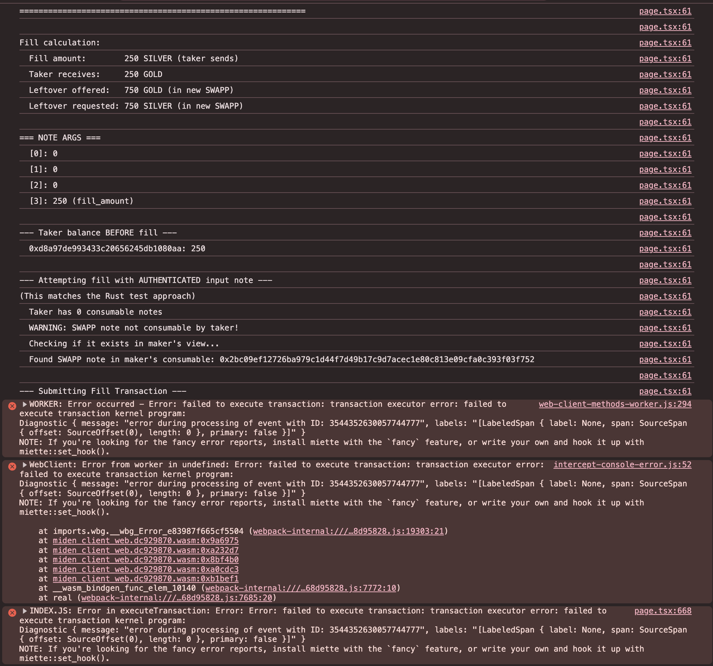

# PSWAP Partial Fill Reproduction

Minimal reproduction of a partial swap note consumption issue using the Miden WebClient SDK.

## Issue

The PSWAP (partial swap) note script works correctly when tested via the Rust SDK but fails with a VM execution error when using the WebClient (TypeScript/WASM) SDK.

**Error:**
```
failed to execute transaction kernel program
event_id: 3544352630057744777
```



## What This Test Does

1. Creates two faucets (GOLD and SILVER)
2. Creates two wallets (Maker and Taker)
3. Mints 1000 GOLD to Maker, 250 SILVER to Taker
4. Maker creates a PSWAP note offering 1000 GOLD for 1000 SILVER
5. Taker attempts to fill 25% (250 SILVER for 250 GOLD)
6. **Fails at step 5** with VM execution error

The identical flow works in the Rust SDK.

## Setup

```bash
pnpm install
pnpm dev
```

Navigate to http://localhost:3000/partial and click "Run Test".

## Files

- `app/partial/page.tsx` - Test page that runs the full flow
- `lib/masm/pswap.ts` - PSWAP note script (MASM assembly)

## Environment

- Node.js 18+
- `@demox-labs/miden-sdk@0.12.5`
- Next.js 16 (for WASM support)

## Notes

- The test uses public accounts and notes for simplicity
- Wait times are included to allow transactions to commit on testnet
- AccountIds are stored as hex strings and converted back when needed (to avoid WASM GC issues)
